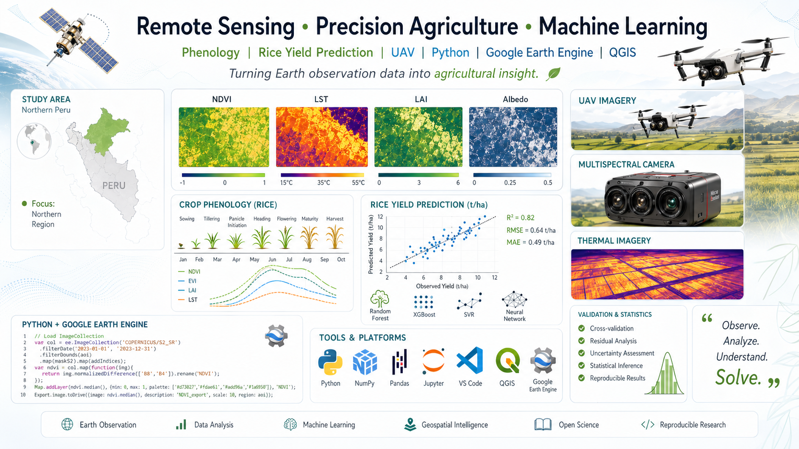

<!-- ========== HERO BANNER ========== -->
<p align="center">
  
</p>

<h1 align="center">Javier Alvaro Quille Mamani</h1>

<p align="center">
  <em>PhD Researcher · Geomatics Engineering · UPV — CGAT</em><br/>
  <em>Remote Sensing &nbsp;•&nbsp; Precision Agriculture &nbsp;•&nbsp; Machine Learning</em>
</p>

<p align="center">
  <a href="https://javier-jaqm.github.io"></a>
  <a href="https://scholar.google.es/citations?user=S-zO5iQAAAAJ"></a>
  <a href="https://www.researchgate.net/profile/Javier-Quille-Mamani"></a>
  <a href="https://www.linkedin.com/in/javier-alvaro-quille-mamani-108444119/"></a>
  <a href="mailto:jalvaro@emin.energy"></a>
</p>

<p align="center">
  
</p>

<blockquote align="center">
  <i>“Observe. Analyze. Understand. <b>Solve.</b>”</i><br/>
  <sub>— Turning Earth observation data into agricultural insight.</sub>
</blockquote>

---

## 👨‍🔬 Sobre mí

Soy **Javier Alvaro Quille Mamani**, investigador doctoral en **Ingeniería Geomática** en la *Universitat Politècnica de València* (UPV), miembro del grupo **Cartografía Geoambiental y Teledetección (CGAT)**.

Mi trabajo combina **teledetección satelital y UAV**, **agricultura de precisión** y **modelización ambiental** para resolver problemas reales en cultivos andinos y mediterráneos.

- 🎓 PhD candidate · Geomatics Engineering · UPV
- 🌾 Cultivos: arroz, quinua, vid, olivo
- 🛰️ Sensores: Sentinel-2/3, Landsat, MODIS, UAV multiespectral & térmico
- 🧪 Ex-investigador en **UNALM (Perú)** — proyectos en Lambayeque y Tacna
- 📍 Actualmente en **Valencia, España**
- 📚 22 publicaciones · 213 citas · h-index 8 *(Google Scholar)*

---

## 🔬 Líneas de investigación

```yaml
remote_sensing:
  - Crop yield prediction (rice, vineyards)
  - Phenology metrics from NDVI/EVI time series
  - Evapotranspiration (METRIC, SEBAL, PT-JPL)
  - CWSI thermal stress mapping
uav_workflows:
  - Multispectral & thermal photogrammetry
  - Radiometric calibration
  - Plot-level vegetation indices
hydrology:
  - Groundwater recharge modeling
  - SWAT / MODFLOW coupling
machine_learning:
  - Random Forest, XGBoost, SVR
  - Deep learning for spatiotemporal data (LSTM, CNN)
  - Feature engineering from time-series indices
```

---

## 🛠️ Stack técnico

<p align="center">
  
  
  
  
  
  
  
  
  
  
  
  
  
  
  
</p>

---

## 📊 GitHub stats

<p align="center">
  
  
</p>

<p align="center">
  
</p>

<p align="center">
  
</p>

---

## 📌 Repositorios destacados

- 🌐 [**Javier-JAQM.github.io**](https://github.com/Javier-JAQM/Javier-JAQM.github.io) — Mi sitio personal y portafolio académico.
- 🌾 [**Phenology-metrics-Rice**](https://github.com/JavierQuille/Phenology-metrics-Rice) — Extracción de métricas fenológicas a partir de series NDVI para predicción de rendimiento de arroz.

---

## 🤝 ¿Colaboramos?

Estoy abierto a **colaboraciones de investigación**, **revisión de manuscritos**, **dirección de TFM/TFG** en teledetección aplicada y **proyectos de transferencia** con cooperativas agrarias.

📬 **jalvaro@emin.energy**

<p align="center">
  
</p>

<p align="center">
  
</p>
